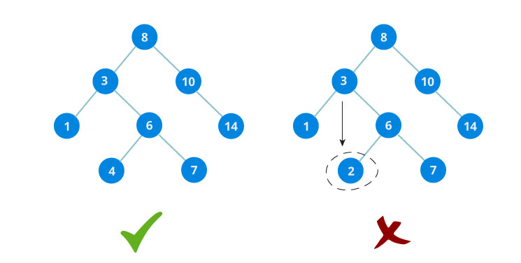

### 1、binarySearch


```c++
int binarySearch(int arr[], int n, int target)
{
    int l = 0;
    int r = n - 1;
    while (l <= r)
    {
        int m = l + (r - l) / 2;
        if (arr[m] == target)
            return m;
        if (target < arr[m])
            r = m - 1;//arr[l...m-1]
        else 
            l = m + 1;//arr[m+1...r]
    }
    return -1;//target not found!
}
```

```c++
int binarySearch(int arr[], int n, int target)
{
    int l = 0;
    int r = n;
    while (l < r)
    {
        int m = l + (r - l) / 2;
        if (arr[m] == target)
            return m;
        if (arr[m] > target)
            r = m ;//arr[l...m)
        else 
            l = m + 1;//arr[m+1...r),前面arr[m] == target已经把索引m的值排除过了，所以不需要再比较
    }
    return -1;//target not found!
}
```

### 2、binary search tree

1. All nodes of left subtree are less than root node
2. All nodes of right subtree are more than root node
3. Both subtrees of each node are also BSTs i.e. they have the above two properties



#### search in BST


```c++
If root == NULL 
    return NULL;
If number == root->data 
    return root->data;
If number < root->data 
    return search(root->left)
If number > root->data 
    return search(root->right)
```

#### insert a node


```c++
if (node == NULL)
	return createNode(data);
if (data < node->data)
    node->left = insert(node->left, data);
else if (data > node->data)
    node->right = insert(node->right, data);
return node;
```

##### example

```c++
struct node
{
    int data;
    struct node* left;
    struct node* right;
};

struct node* createNode(value)
{
    struct node* newNode = malloc(sizeof(struct node));
    newNode->data = value;
    newNode->left = NULL;
    newNode->right = NULL;
    
    return newNode;
}

struct node* insert(struct node* root, int data)
{
    if (root == NULL)
        return createNode(data);
    if (data < root->data)
        root->left = insert(root->left, data);
    else
        root->right = insert(root->right, data);
    
    return root;
}

int* search(struct node* root, int data)
{
    if (root == NULL)
        return NULL;
    if (data == root->data)
        return &(root->data);
    else if (data < root->data)
        return search(root->left);
    else 
        return search(root->right);
}


```

