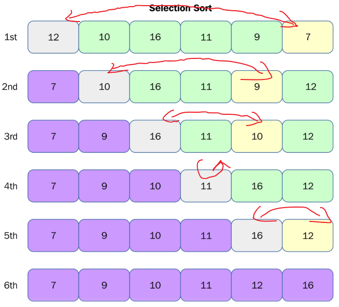

### 1、Selection Sort

```
arr[] = 12 10 16 11 9 7

// Find the minimum element in arr[0...5]
// and place it at beginning
7 10 16 11 9 12

// Find the minimum element in arr[1...5]
// and place it at beginning of arr[1...5]
7 9 16 11 10 12

// Find the minimum element in arr[2...5]
// and place it at beginning of arr[2...5]
7 9 10 11 16 12

// Find the minimum element in arr[3...5]
// and place it at beginning of arr[3...5]
7 9 10 11 16 12

// Find the minimum element in arr[4...5]
// and place it at beginning of arr[4...5]
7 9 10 11 12 16
```



```
void selectionSort(int arr[], int n){
    for(int i = 0 ; i < n ; i ++){
        // find the minimum element in [i, n)
        int minIndex = i;
        for( int j = i + 1 ; j < n ; j ++ )
            if( arr[j] < arr[minIndex] )
                minIndex = j;
                
        swap( arr[i] , arr[minIndex] );
    }
}
```

