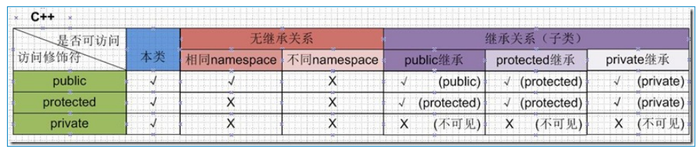

### 一、构造函数

一个类如果没有显式定义构造函数，则有编译器自动生成。

如果定义了一个显式的构造函数，则实例化一个类时必须用匹配的构造函数。

可以使用初始化列表来初始化字段

```c++
Human(string humansName, int humansAge):name(humansName), age(humansAge)
{
    cout << "Constructed a human called " << name;
    cout << ", " << age << " years old" << endl;
}
```

### 二、访问权限

默认为 private



### 三、析构函数

一个类如果没有显式定义析构函数，则有编译器自动生成一个dummy destructor，但是这个析构函数不会清理动态分配的内存。析构函数没有参数，也没有返回值

```c++
    ~MyString()
    {
        cout<<"Invoking destructor, clearing up" << endl;
        if (buffer != NULL)
            delete [] buffer;
    }
```


### 四、copy constructor 拷贝构造函数

深拷贝、浅拷贝， 如果一个类中有诸如int * 这样的类型，浅拷贝产生的成员与源对象的int * 指向同一个内存地址，会带来析构函数的安全隐患。因为此时有两个对象，一个对象销毁的时候，int *指向的内存已经被释放，当另一个对象也被销毁的时候，会重新执行int * 的释放，此时就出现问题了。二次delete一个悬垂指针行为是未定义的。

### 五、explicit

可以阻止不应该允许的经过转换构造函数进行的隐式转换发生，只对有一个参数的类构造函数有效

```c++
//
// Created by yuan on 2018/10/19.
//
#include <iostream>
using namespace std;

class Human
{
    int age;
public:
    explicit Human(int huanmAge) : age(huanmAge) {}
//    Human(int huanmAge) : age(huanmAge) {}
};

void DoSomething(Human person)
{
    cout << "Human sent did something" << endl;
    return;
}

int main()
{
    Human kid(10);
    Human anotherKid = Human(11);
    DoSomething(kid);

//    Human anotherKid2 = 11;//failure: implicit conversion not work
//    DoSomething(10);
    return 0;
}

```

### 五、this

this 是 C++ 中的一个关键字，也是一个 const 指针，它指向当前对象，通过它可以访问当前对象的所有成员。

this 只能用在类的内部

注意，this 是一个指针，要用`->`来访问成员变量或成员函数。

### 六、sizeof 一个类

sizeof 是一个运算符。

```c++
class Huamn
{
    private:
    int age;
    bool gender;
}
Human man;
int a = sizeof(Huamn);
int b = sizeof(man);
```

$$
a = b = 8bytes
$$

int 占4个字节，bool占1个字节，由于字节补全，所以一共占据 8个字节。

### 七、struct vs class

```c++
struct Human
{
    // constructor, public by default (as no access specified is mentioned)
    //				class's accessibility private by default
    Human(const MyString& humansName, int humansAge, bool humansGender)
    	: name(humansName), age (humansAge), Gender(humansGender) {}int GetAge ()
    {
        return age;
    }
private:
    int age;
    bool gender;
    MyString name;
};
```

a struct Human is similar to class Human, and instantiation of an object of type struct would be similar to type class as well 

Unless specified,members in a struct are public by default (private for a class) 

### 八、friend

Using the friend Keyword to Allow an External Function Show() Access to Private Data Members 

```c++
//
// Created by yuan on 2018/10/22.
//
#include <iostream>
#include <string>
using namespace std;

class Human
{
private:
    friend void Show(const Human& person);
    string name;
public:
    Human(string humanName)
    {
        name = humanName;
    }
};

void Show(const Human& person)
{
    cout << person.name << endl;
}

int main()
{
    Human man("Amy");
    Show(man);

    return 0;
}


```

if we delete the keyword 'friend', we get an compile error

'std::string Human::name' is private within this context

Like functions, external classes can also be designated as a trusted friend

### 九、union

与struct 类似，默认为public，但是不能继承

### 十、aggregate initialization 

在`C++`中对于聚合体（aggregate）的初始化称为聚合初始化

```c++
struct Aggregate1
{
    int num;
    double pi;
};
//我们可以这样来初始化
Aggregate1 a1{ 2017, 3.14 }; 
//另一个例子
struct Aggregate2
{
    int num;
    char hello[6];
    int impYears[5];
};
Aggregate2 a2 {42, {'h', 'e', 'l', 'l', 'o'}, {1998, 2003, 2011, 2014, 2017}};
```


