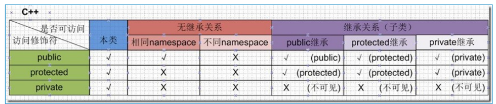

### 一、构造函数

一个类如果没有显式定义构造函数，则有编译器自动生成。

如果定义了一个显式的构造函数，则实例化一个类时必须用匹配的构造函数。

可以使用初始化列表来初始化字段

```
Human(string humansName, int humansAge):name(humansName), age(humansAge)
{
cout << "Constructed a human called " << name;
cout << ", " << age << " years old" << endl;
}
```

### 二、访问权限



### 三、析构函数

一个类如果没有显式定义析构函数，则有编译器自动生成一个dummy destructor，但是这个析构函数不会清理动态分配的内存。析构函数没有参数，也没有返回值

```
    ~MyString()
    {
        cout<<"Invoking destructor, clearing up" << endl;
        if (buffer != NULL)
            delete [] buffer;
    }
```


